<picture>
  <source media="(prefers-color-scheme: dark)" srcset="banner.svg">
  <source media="(prefers-color-scheme: light)" srcset="banner-light.svg">
  
</picture>

 

  

 

## About Me

I'm a Computer Science Engineering student and full-stack developer who likes turning ideas into working products — from the database schema up to the pixel-perfect UI. Equal parts curious about how things work under the hood and eager to actually ship them.

- 🎓 Computer Science Engineering Student
- 💻 Full-Stack Developer
- 🌱 Always learning something new in the stack
- ☕ Fueled by coffee, curiosity, and clean commits

 

## Tech Stack

 

## GitHub Stats

<table>
  <tr>
    <td></td>
    <td></td>
  </tr>
</table>

 

## Contribution Snake 🐍

<picture>
  <source media="(prefers-color-scheme: dark)" srcset="https://raw.githubusercontent.com/Sakshi-patil48/Sakshi-patil48/output/github-contribution-grid-snake-dark.svg">
  <source media="(prefers-color-scheme: light)" srcset="https://raw.githubusercontent.com/Sakshi-patil48/Sakshi-patil48/output/github-contribution-grid-snake.svg">
  
</picture>

 

## Let's Connect

**Code. Coffee. Repeat.**

 

